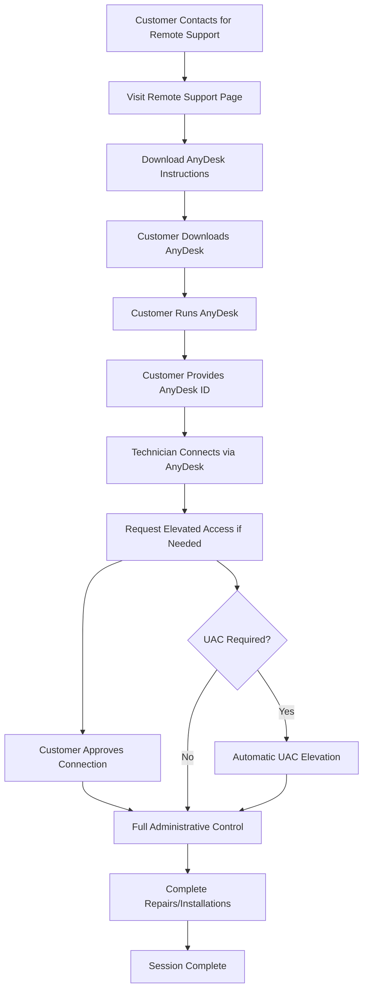
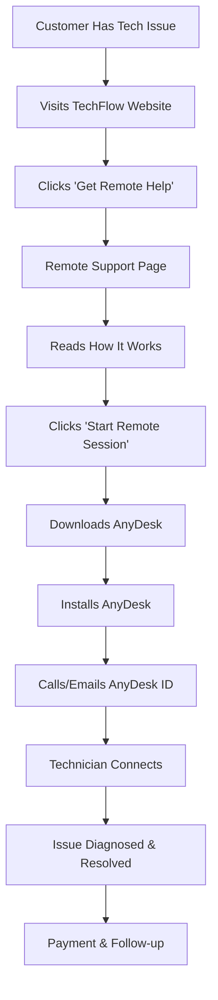

# AnyDesk Remote Support Implementation Plan for TechFlow Solutions

## Updated Solution: AnyDesk Free → Professional Upgrade Path

Based on your preference for AnyDesk, this plan provides a clear upgrade path from free to professional licensing as your business grows.

## AnyDesk Advantages for TechFlow Solutions

### ✅ Free Version Benefits
- **UAC Elevation Support** - Full administrative access
- **Professional Interface** - Clean, branded appearance
- **Reliable Connection** - Enterprise-grade infrastructure
- **Easy Setup** - Simple customer installation process
- **File Transfer** - Built-in file sharing capabilities

### ✅ Upgrade Path to Professional ($10.99/month)
- **Custom Branding** - Your company logo and colors
- **Unattended Access** - Connect without customer present
- **Address Book** - Manage customer connections
- **Session Recording** - Document work performed
- **Priority Support** - Faster technical assistance

## AnyDesk vs Free Alternatives Comparison

| Feature | AnyDesk Free | AnyDesk Pro | Windows Quick Assist | RustDesk |
|---------|-------------|-------------|---------------------|----------|
| UAC Elevation | ✅ Yes | ✅ Yes | ❌ No | ✅ Yes |
| Commercial Use | ⚠️ Limited | ✅ Full | ✅ Yes | ✅ Yes |
| Custom Branding | ❌ No | ✅ Yes | ❌ No | ❌ No |
| Unattended Access | ❌ No | ✅ Yes | ❌ No | ✅ Yes |
| File Transfer | ✅ Yes | ✅ Yes | ❌ No | ✅ Yes |
| Setup Complexity | Low | Low | Low | Medium |
| Reliability | High | High | Medium | Medium |

## Implementation Workflow with AnyDesk



## Website Integration Strategy

### 1. Remote Support Page Content Structure
```
/remote-support.html
├── Hero: "Get Instant Professional Remote Help"
├── AnyDesk Benefits: Why we chose AnyDesk
├── How It Works: 4-step process
├── Download & Setup: Direct AnyDesk download
├── What We Can Fix: Services available remotely
├── Pricing: Remote support rates
├── FAQ: Common questions and troubleshooting
└── Contact: Backup support options
```

### 2. Key Messaging Points
- **"Professional Remote Support with Full Administrative Access"**
- **"Same expertise as on-site visits, without the travel time"**
- **"Secure, encrypted connections using enterprise-grade AnyDesk"**
- **"Install software, update drivers, and configure systems remotely"**

## Customer Journey with AnyDesk



## Implementation Phases

### Phase 1: Foundation Setup (Week 1)
1. **Create AnyDesk Account**
   - Set up business AnyDesk account
   - Test UAC elevation on various Windows versions
   - Document setup process and limitations

2. **Develop Remote Support Page**
   - Create [`remote-support.html`](remote-support.html)
   - Include AnyDesk download links and instructions
   - Add pricing and service information

3. **Create Customer Documentation**
   - Step-by-step AnyDesk installation guide
   - Troubleshooting common connection issues
   - What to expect during remote sessions

### Phase 2: Website Integration (Week 2)
1. **Update Existing Pages**
   - Enhance homepage remote support messaging
   - Add remote support section to services page
   - Update contact page with remote support options

2. **Create Support Materials**
   - Printable quick-start guide for customers
   - Video tutorial for AnyDesk setup (optional)
   - FAQ section addressing common concerns

### Phase 3: Launch & Optimization (Week 3-4)
1. **Soft Launch Testing**
   - Test with 3-5 existing customers
   - Refine process based on feedback
   - Monitor connection success rates

2. **Full Launch**
   - Announce remote support availability
   - Update marketing materials
   - Train staff on AnyDesk procedures

## AnyDesk Setup Process for Customers

### Simple 4-Step Process:
1. **Visit Remote Support Page** - Clear instructions and download link
2. **Download AnyDesk** - Direct link to AnyDesk installer
3. **Run AnyDesk** - No installation required, runs immediately
4. **Share Your ID** - 9-digit number displayed in AnyDesk

### Customer Instructions Template:
```
🔧 TechFlow Solutions Remote Support Setup

1. Download AnyDesk: [Direct Link]
2. Run the downloaded file (no installation needed)
3. Your AnyDesk ID will appear (9 digits)
4. Call us at (647) 572-8321 with your ID
5. We'll connect and fix your issue remotely!

Need help? We're here to guide you through each step.
```

## Pricing Strategy for AnyDesk Implementation

### Remote Support Service Rates
- **Standard Remote Session**: $75/hour (1-hour minimum)
- **Emergency Remote Support**: $125/hour (evenings/weekends)
- **Follow-up Sessions**: $50/hour (within 7 days)
- **Monthly Remote Support Plan**: $199/month (up to 4 hours)

### Value Proposition
- **No Travel Charges** - Save $50+ in travel fees
- **Immediate Service** - Connect within minutes
- **Full Administrative Access** - Complete repairs remotely
- **Professional Tools** - Enterprise-grade remote access

## Upgrade Timeline to AnyDesk Professional

### Upgrade Triggers (Recommend upgrading when):
- **10+ remote sessions per month** - ROI justifies cost
- **Repeat customers** - Unattended access valuable
- **Branding important** - Professional appearance matters
- **Session documentation needed** - Recording capabilities required

### Professional Features ROI:
- **Unattended Access**: Service customers without them present
- **Custom Branding**: Professional appearance builds trust
- **Session Recording**: Document work for warranty/billing
- **Address Book**: Faster connections to repeat customers

## Technical Implementation Details

### AnyDesk Configuration
1. **Security Settings**
   - Enable password protection
   - Set up access control lists
   - Configure session logging

2. **Performance Optimization**
   - Adjust quality settings for connection speed
   - Configure file transfer permissions
   - Set up automatic reconnection

### Integration with Existing Workflow
1. **Booking System Integration**
   - Add remote support option to booking form
   - Include AnyDesk ID collection field
   - Automated confirmation emails with instructions

2. **Customer Management**
   - Track remote session history
   - Document AnyDesk IDs for repeat customers
   - Monitor upgrade opportunities

## Success Metrics & KPIs

### Technical Metrics
- **Connection Success Rate**: Target >95%
- **Session Completion Rate**: Target >98%
- **Average Session Duration**: Track efficiency
- **Customer Satisfaction**: Post-session surveys

### Business Metrics
- **Remote Support Revenue**: Monthly tracking
- **Conversion Rate**: Website visitors to sessions
- **Repeat Customer Rate**: Remote support retention
- **Upgrade Timing**: When to move to Professional

## Risk Mitigation

### AnyDesk Free Version Limitations
- **Commercial Use Detection**: Monitor for usage warnings
- **Session Time Limits**: Plan for potential restrictions
- **Feature Limitations**: Document what's not available

### Backup Procedures
1. **Connection Failures**: Fall back to phone guidance
2. **AnyDesk Issues**: Have Windows Quick Assist as backup
3. **Customer Difficulties**: Offer on-site visit option

## Budget Analysis

### Phase 1 Costs (Free AnyDesk)
- **Development Time**: 12-16 hours
- **AnyDesk License**: $0/month
- **Documentation Creation**: 4-6 hours
- **Total Initial Investment**: 16-22 hours

### Phase 2 Costs (Professional Upgrade)
- **AnyDesk Professional**: $10.99/month
- **Additional Features Setup**: 2-4 hours
- **Staff Training**: 2-3 hours
- **Monthly Operating Cost**: $10.99

### ROI Calculation
- **Break-even**: 1 remote session per month at $75/hour
- **Profit Margin**: ~85% (minimal overhead costs)
- **Growth Potential**: Scale without additional travel time

## Next Steps for Implementation

### Immediate Actions (This Week)
1. Create AnyDesk business account
2. Test AnyDesk on multiple Windows versions
3. Begin remote support page development

### Development Tasks (Next Week)
1. Build remote support webpage
2. Create customer instruction materials
3. Update existing pages with remote support integration

### Launch Preparation (Week 3)
1. Internal testing with team
2. Beta testing with select customers
3. Staff training on AnyDesk procedures

This AnyDesk-focused implementation provides you with a professional remote support solution that can grow with your business, starting free and upgrading to professional features as your remote support volume increases.