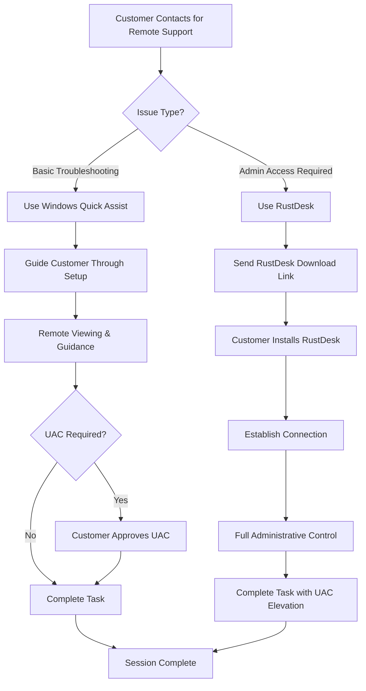
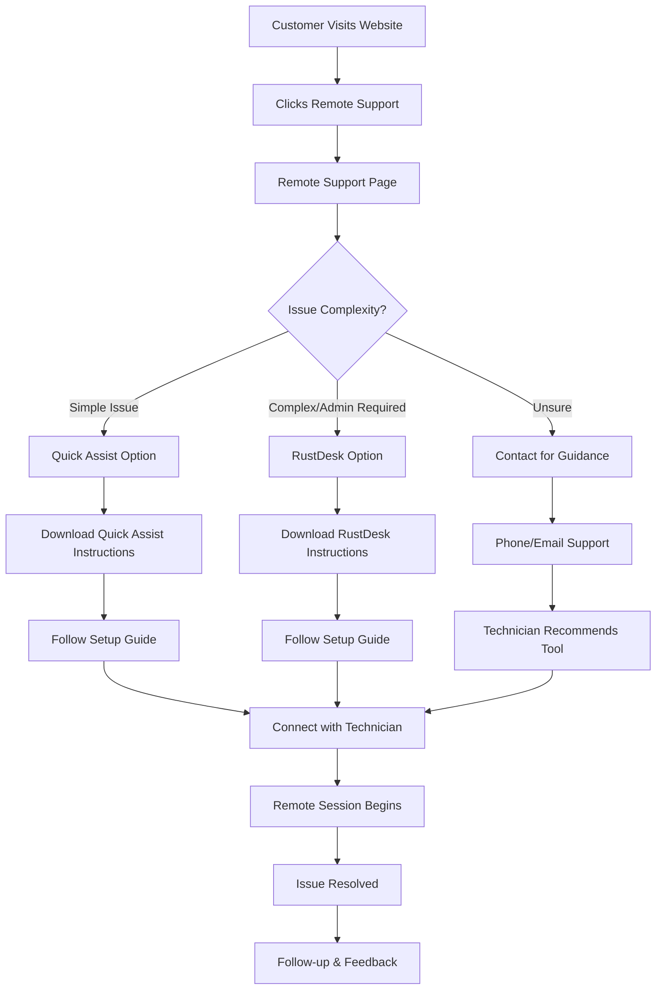
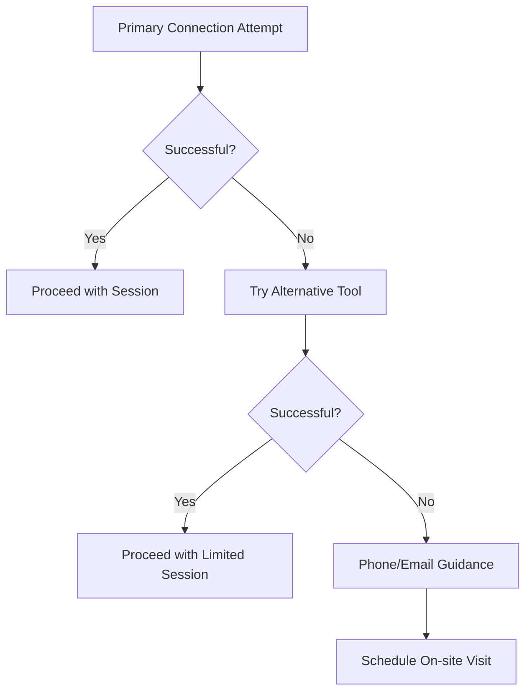

# Remote Support Implementation Plan for TechFlow Solutions

## Key Research Findings Summary

**CRITICAL ANSWER TO YOUR QUESTION**: 
❌ **Windows Quick Assist and Chrome Remote Desktop do NOT allow UAC elevation**
- Both solutions run in user context only
- Technician cannot bypass or control UAC prompts
- Customer must manually approve all administrative actions
- This severely limits your ability to install software, drivers, or make system changes

## Recommended Solution: RustDesk + Windows Quick Assist Hybrid

Based on your requirements for full administrative access and budget constraints, I recommend implementing **RustDesk** as the primary solution with **Windows Quick Assist** as backup.

### Why RustDesk?
- ✅ **Free and Open Source** - No commercial restrictions
- ✅ **UAC Elevation Support** - Full administrative access
- ✅ **Professional Features** - File transfer, unattended access
- ✅ **Self-hosting Option** - Better control and privacy

## Implementation Workflow



## Website Integration Design

### 1. Remote Support Page Structure
```
/remote-support.html
├── Hero Section - "Get Instant Remote Help"
├── How It Works - 3-step process
├── Tool Selection Guide - When to use which tool
├── Download Links & Instructions
├── FAQ Section - Common setup issues
└── Contact for Help - Fallback support
```

### 2. Integration Points on Existing Pages

#### Homepage Updates:
- Enhance "Remote Support" feature in Emergency Support section
- Add prominent "Get Remote Help Now" button
- Link to new remote support page

#### Services Page Updates:
- Add detailed remote support service description
- Include pricing for remote sessions
- Highlight UAC elevation capabilities

#### Contact Page Updates:
- Add remote support as contact option
- Include emergency remote support phone line

## Customer Journey Workflow



## Implementation Phases

### Phase 1: Foundation (Week 1-2)
1. **Create Remote Support Page**
   - Design and develop `/remote-support.html`
   - Include tool comparison and selection guide
   - Add download links and basic instructions

2. **Test RustDesk Implementation**
   - Set up RustDesk on test systems
   - Verify UAC elevation functionality
   - Document setup process and common issues

3. **Create Basic Documentation**
   - Customer setup guides for both tools
   - Troubleshooting common connection issues
   - Internal procedures for technicians

### Phase 2: Integration (Week 3-4)
1. **Update Existing Pages**
   - Enhance homepage remote support messaging
   - Add remote support details to services page
   - Update contact page with remote options

2. **Create Support Materials**
   - Video tutorials for customer setup
   - Printable quick-start guides
   - FAQ section with common issues

3. **Staff Training**
   - Train on both RustDesk and Quick Assist
   - Practice UAC elevation procedures
   - Develop customer communication scripts

### Phase 3: Launch & Optimization (Week 5-6)
1. **Soft Launch**
   - Test with select customers
   - Gather feedback and refine processes
   - Monitor connection success rates

2. **Full Launch**
   - Announce remote support availability
   - Update marketing materials
   - Monitor and optimize customer experience

## Technical Implementation Details

### RustDesk Setup Process
1. **Customer Downloads RustDesk**
   - Direct download link from website
   - Automatic installation guide
   - Firewall configuration instructions

2. **Connection Establishment**
   - Customer provides ID and password
   - Technician connects remotely
   - Verify administrative access

3. **Session Management**
   - Full screen control with UAC elevation
   - File transfer capabilities
   - Session recording for documentation

### Windows Quick Assist Backup
1. **When to Use**
   - Simple troubleshooting tasks
   - When RustDesk connection fails
   - Customer prefers Microsoft solution

2. **Limitations Management**
   - Clear communication about UAC limitations
   - Guided approach for administrative tasks
   - Customer education on approval process

## Pricing Strategy

### Remote Support Service Pricing
- **Basic Remote Session**: $75/hour (minimum 30 minutes)
- **Emergency Remote Support**: $125/hour (same-day, evenings, weekends)
- **Follow-up Sessions**: $50/hour (within 7 days of initial service)

### Value Proposition
- No travel time charges
- Immediate assistance available
- Full administrative capabilities with RustDesk
- Professional tools and expertise

## Risk Mitigation & Backup Procedures

### Connection Failure Backup Plan


### Security Considerations
1. **RustDesk Security**
   - End-to-end encryption
   - Session passwords
   - Connection logging

2. **Customer Privacy**
   - Clear privacy policy
   - Session recording consent
   - Data handling procedures

## Success Metrics & KPIs

### Technical Metrics
- Connection success rate (target: >90%)
- Session completion rate (target: >95%)
- Average session duration
- UAC elevation success rate

### Business Metrics
- Remote support revenue
- Customer satisfaction scores
- Repeat remote support usage
- Conversion from remote to on-site services

## Next Steps for Implementation

1. **Immediate Actions**
   - Test RustDesk on various Windows versions
   - Create customer setup documentation
   - Design remote support webpage mockup

2. **Development Tasks**
   - Build remote support page
   - Update existing pages with remote support integration
   - Create customer instruction materials

3. **Testing & Launch**
   - Internal testing with team members
   - Beta testing with select customers
   - Full launch with marketing support

## Budget Breakdown

### Development Costs
- Website development: 8-12 hours
- Documentation creation: 4-6 hours
- Testing and refinement: 4-6 hours
- **Total Development Time**: 16-24 hours

### Ongoing Costs
- RustDesk: $0/month (free)
- Additional support time: Minimal
- **Monthly Operating Cost**: $0

This implementation provides you with professional remote support capabilities while maintaining your budget-conscious approach, with the critical UAC elevation functionality you need for software installations and system administration tasks.